# 📚 Library Management System — Full Project Documentation

**Student Name:** Sanket Pal
**Project Title:** Library Management System
**Technology:** HTML5 · CSS3 · JavaScript · localStorage
**Date:** May 2026
**🌐 Live Website:** [https://sanketpal528-cyber.github.io/library_management.py/](https://sanketpal528-cyber.github.io/library_management.py/)
**📁 GitHub Repo:** [https://github.com/sanketpal528-cyber/library_management.py](https://github.com/sanketpal528-cyber/library_management.py)

---

## 📋 Table of Contents

1. [Project Overview](#1-project-overview)
2. [System Architecture](#2-system-architecture)
3. [Use Case Diagram](#3-use-case-diagram)
4. [Class Diagram](#4-class-diagram)
5. [Entity Relationship Diagram](#5-entity-relationship-diagram)
6. [Sequence Diagrams](#6-sequence-diagrams)
7. [Activity Diagrams](#7-activity-diagrams)
8. [State Diagram](#8-state-diagram)
9. [Component Diagram](#9-component-diagram)
10. [Data Flow Diagram](#10-data-flow-diagram)
11. [Module Descriptions](#11-module-descriptions)
12. [File Structure](#12-file-structure)
13. [Data Schema](#13-data-schema)
14. [Feature List](#14-feature-list)
15. [Technologies Used](#15-technologies-used)

---

## 1. Project Overview

The **Library Management System (LMS)** is a fully client-side web application that automates the core operations of a library. It allows a librarian to manage books, register members, issue and return books, track overdue fines, and view reports — all from a browser with no server or installation required.

### Key Highlights

| Property | Detail |
|---|---|
| Type | Web Application (Client-Side) |
| Language | HTML5, CSS3, JavaScript (ES6+) |
| Storage | Browser `localStorage` |
| Deployment | GitHub Pages |
| Fine Rate | ₹5 per overdue day |
| Loan Period | 14 days per book |

---

## 2. System Architecture

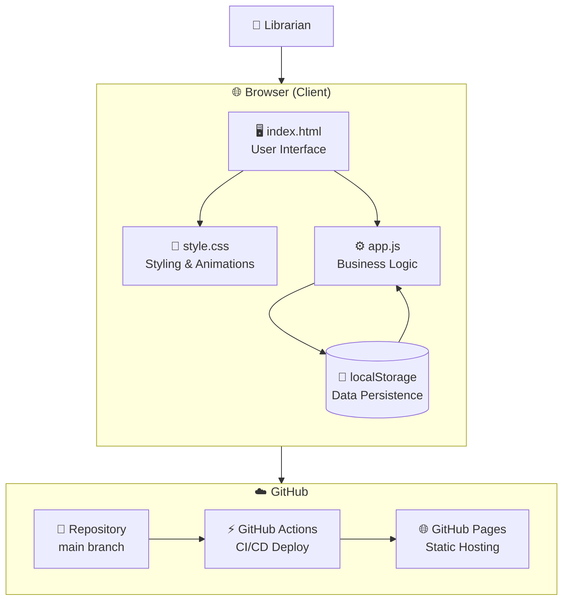

---

## 3. Use Case Diagram

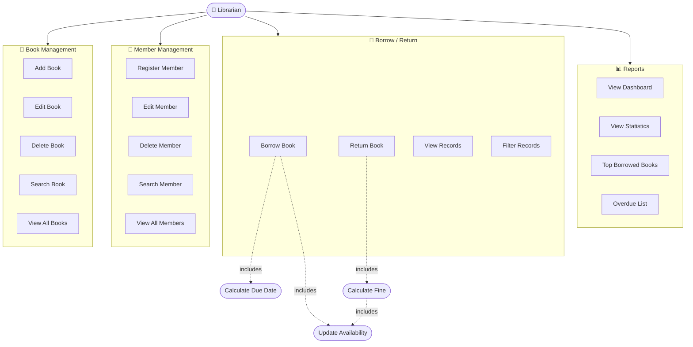

---

## 4. Class Diagram

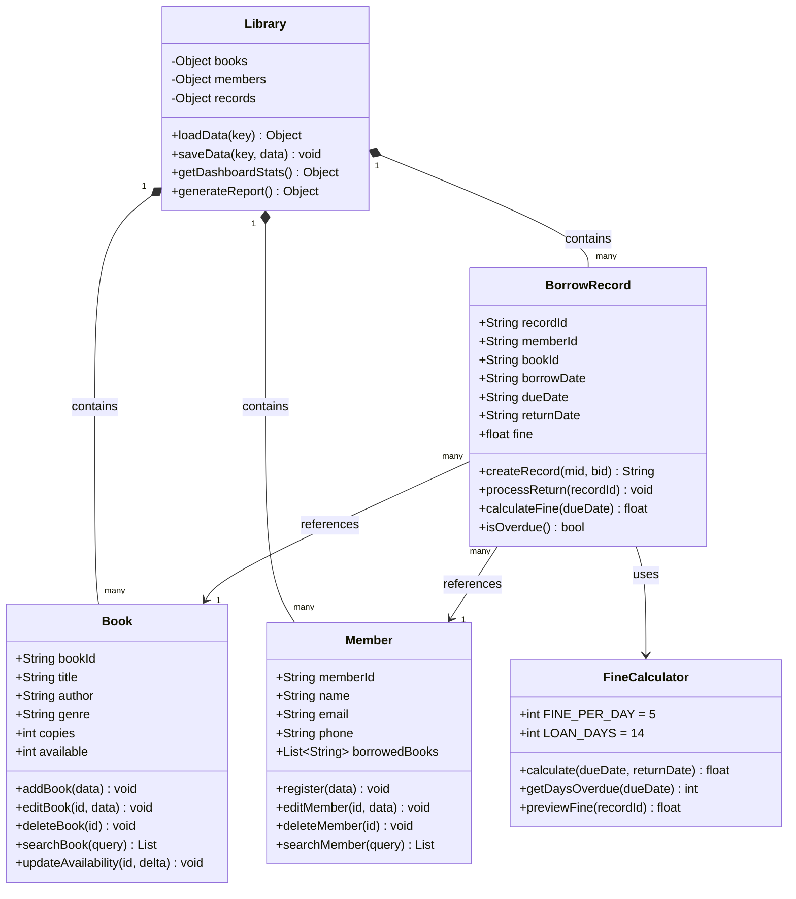

---

## 5. Entity Relationship Diagram

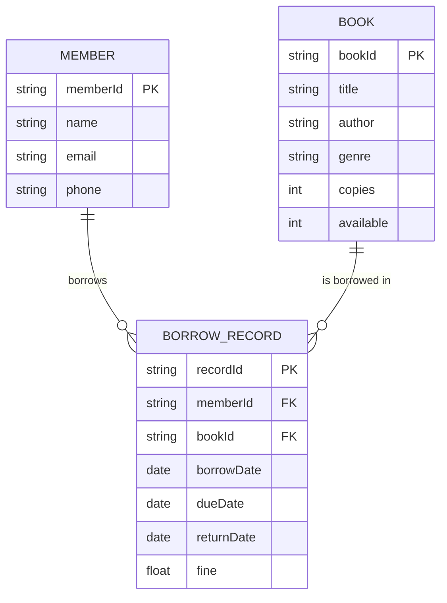

---

## 6. Sequence Diagrams

### 6.1 Add a Book

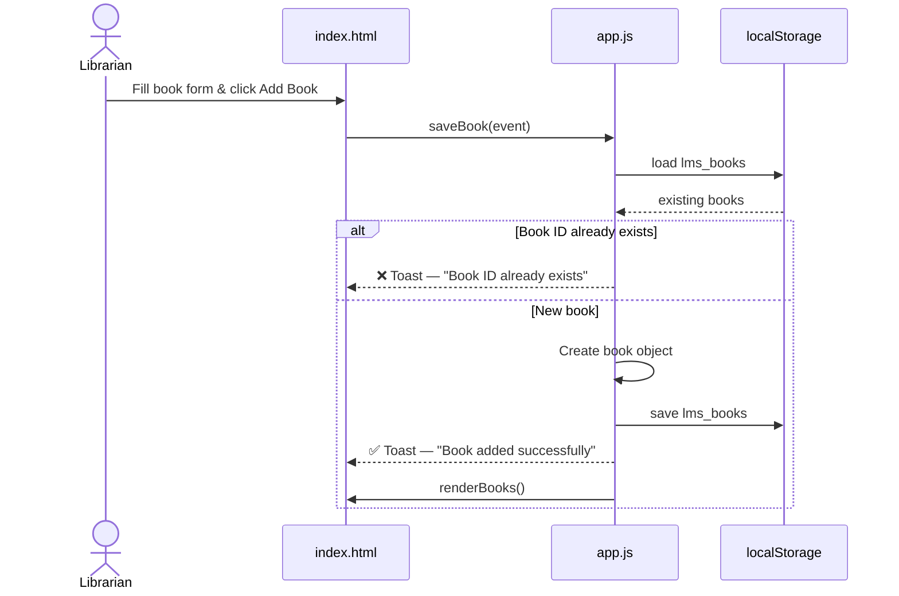

---

### 6.2 Borrow a Book

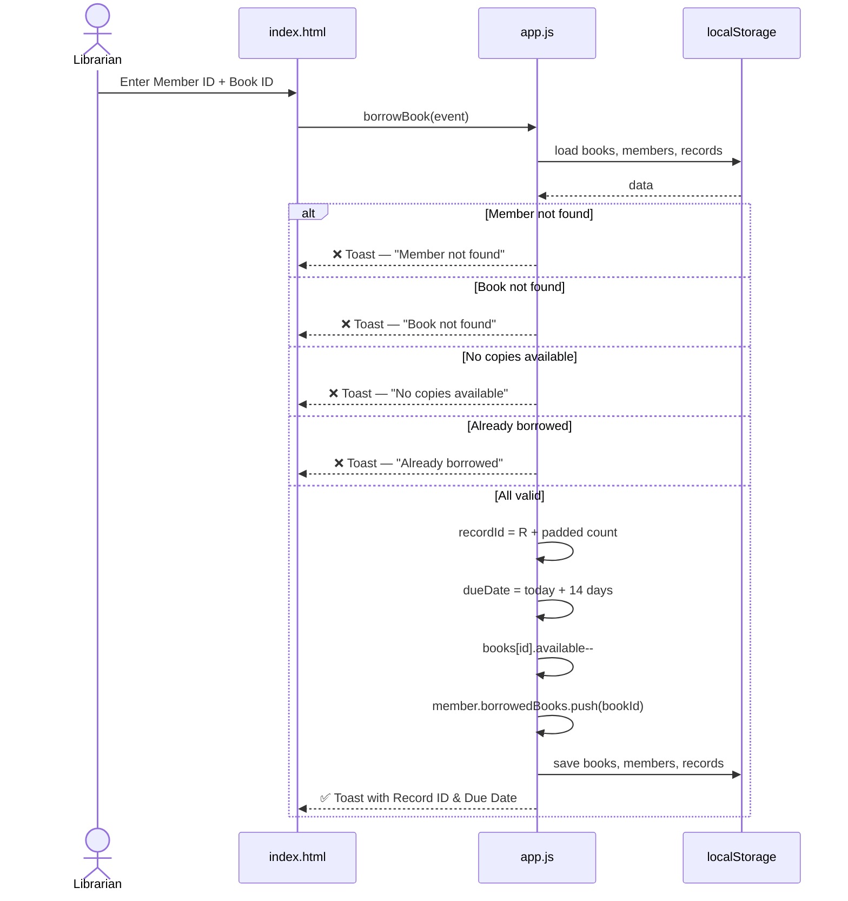

---

### 6.3 Return a Book

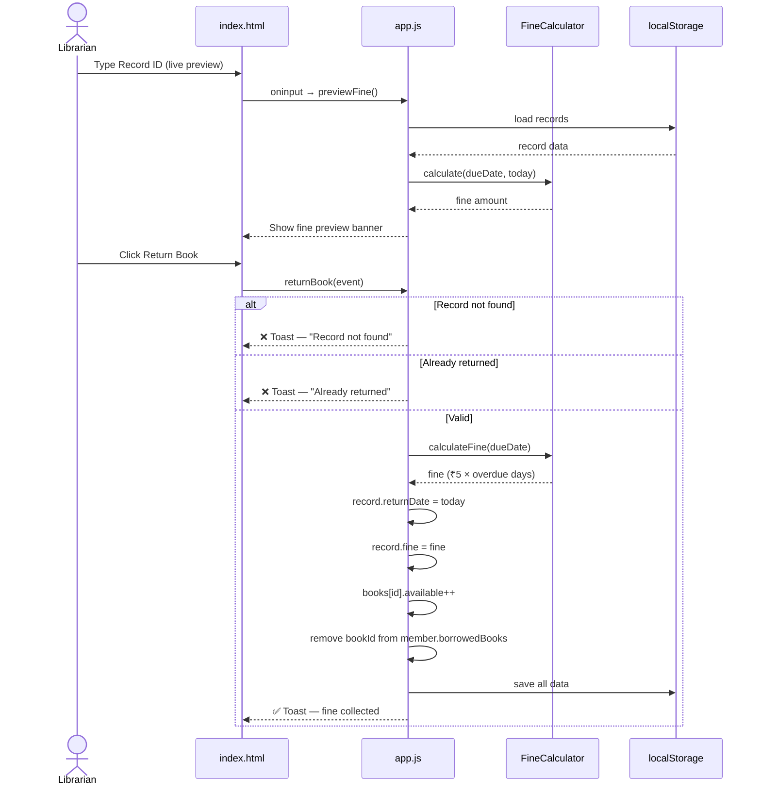

---

### 6.4 View Reports

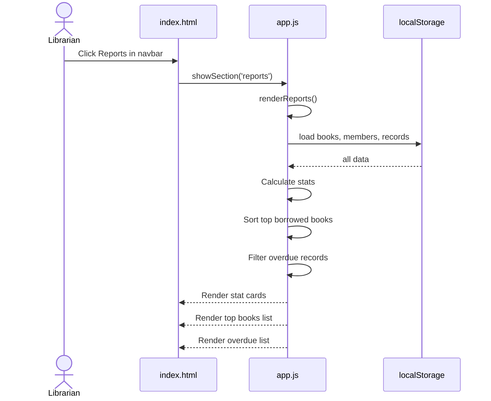

---

## 7. Activity Diagrams

### 7.1 Complete Borrow → Return Flow

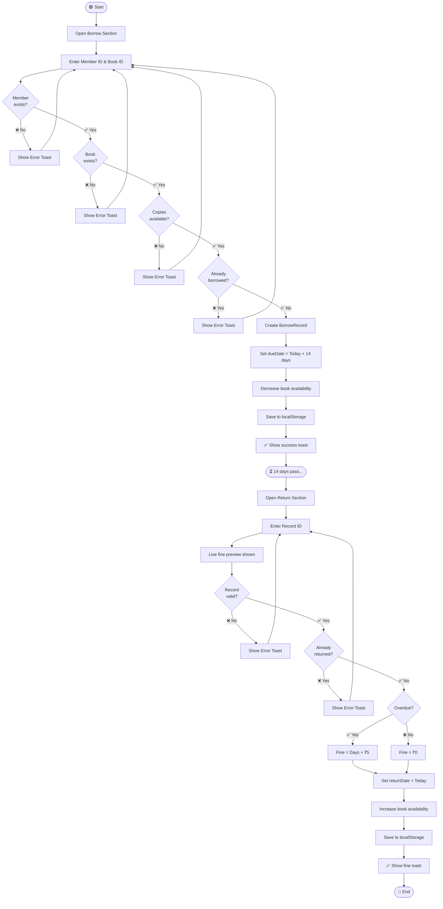

---

### 7.2 Member Registration Flow

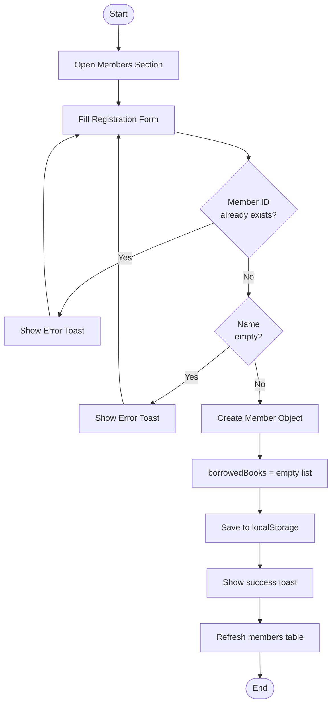

---

## 8. State Diagram

### Book Availability States

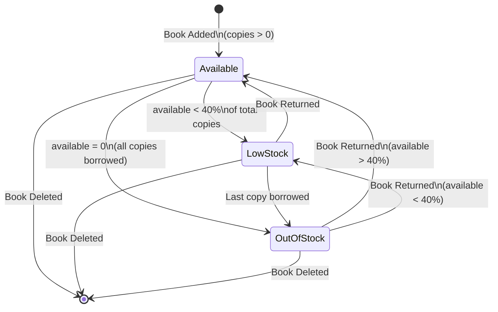

---

### Borrow Record States

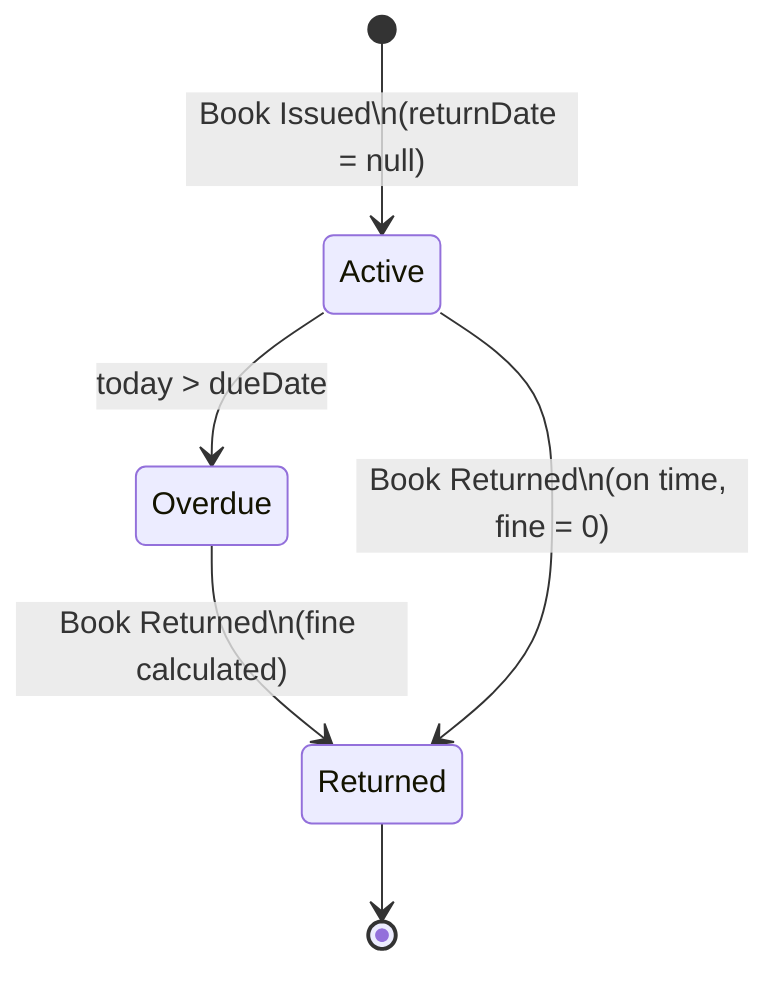

---

## 9. Component Diagram

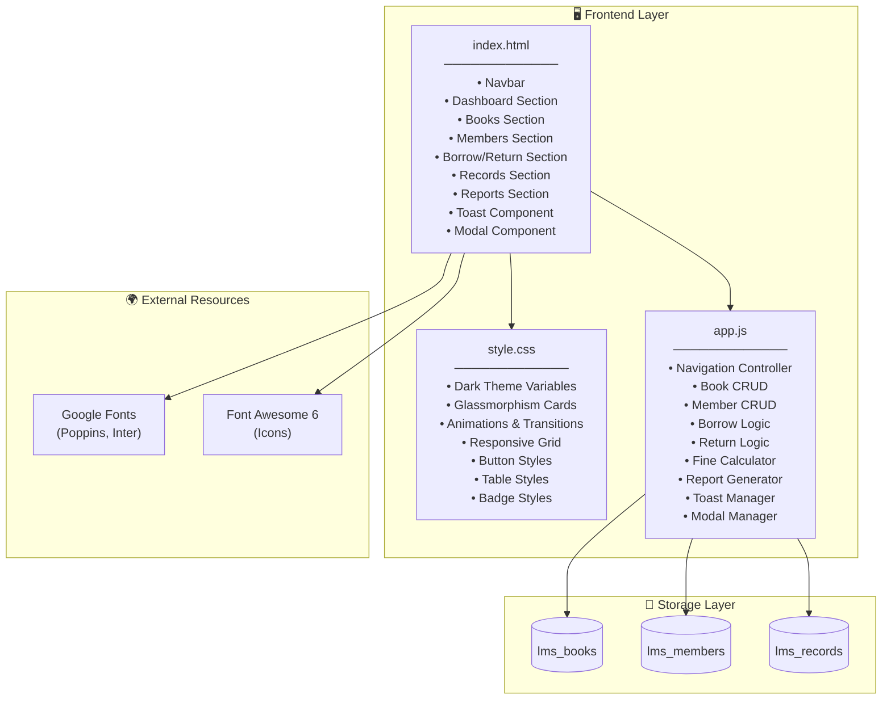

---

## 10. Data Flow Diagram

### Level 0 — Context Diagram

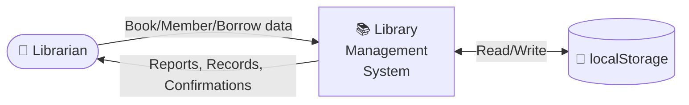

---

### Level 1 — Detailed DFD

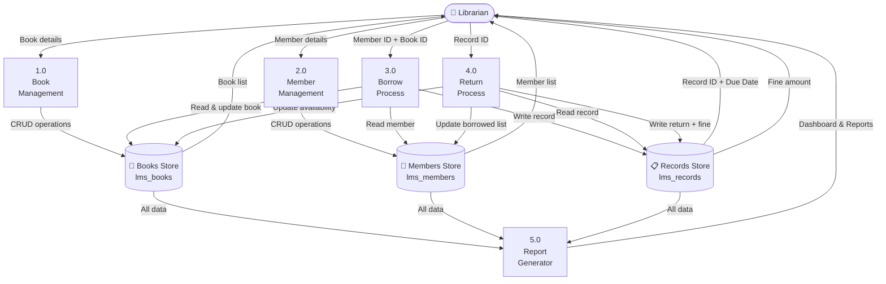

---

## 11. Module Descriptions

### 11.1 Dashboard Module
- Displays 6 live stat cards: Book Titles, Available Copies, Total Members, Active Borrows, Overdue Books, Fines Collected
- Quick action buttons to navigate to key sections
- Auto-refreshes every time the section is opened

### 11.2 Book Management Module
| Function | Description |
|---|---|
| `saveBook(event)` | Adds a new book or updates existing one |
| `editBook(id)` | Pre-fills form with existing book data |
| `deleteBook(id)` | Removes book after confirmation modal |
| `renderBooks()` | Renders filtered/searched book table |
| `cancelBookEdit()` | Resets form to add mode |

### 11.3 Member Management Module
| Function | Description |
|---|---|
| `saveMember(event)` | Registers new member or updates existing |
| `editMember(id)` | Pre-fills form with member data |
| `deleteMember(id)` | Deletes member (blocked if has active borrows) |
| `renderMembers()` | Renders filtered/searched member table |

### 11.4 Borrow / Return Module
| Function | Description |
|---|---|
| `borrowBook(event)` | Validates and issues a book, creates record |
| `returnBook(event)` | Processes return, calculates fine |
| `previewFine()` | Live fine preview on Record ID input |

### 11.5 Records Module
| Function | Description |
|---|---|
| `renderRecords()` | Renders records filtered by All/Active/Returned/Overdue |

### 11.6 Reports Module
| Function | Description |
|---|---|
| `renderReports()` | Calculates and displays all stats |
| Top Books | Counts borrow frequency per book, sorts descending |
| Overdue List | Filters active records past due date |

---

## 12. File Structure

```
micro project/
│
├── index.html                          # Main website (all sections)
├── style.css                           # Dark theme, animations, responsive
├── app.js                              # All JavaScript logic
│
├── main.py                             # Console-based Python version
│
├── README.md                           # Project readme with live link
├── synopsis.md                         # Academic synopsis with UML
├── PROJECT_DOCUMENTATION.md           # This file — full documentation
│
├── Library_Management_System_Design.pdf
├── Library_Management_System_Synopsis.pdf
│
└── .github/
    └── workflows/
        └── deploy.yml                  # GitHub Actions — auto deploy to Pages
```

---

## 13. Data Schema

All data is stored in browser `localStorage` as JSON strings.

### lms_books
```json
{
  "B001": {
    "title": "Python Programming",
    "author": "Guido van Rossum",
    "genre": "Technology",
    "copies": 3,
    "available": 2
  },
  "B002": {
    "title": "Clean Code",
    "author": "Robert C. Martin",
    "genre": "Software Engineering",
    "copies": 2,
    "available": 2
  }
}
```

### lms_members
```json
{
  "M001": {
    "name": "Sanket Pal",
    "email": "sanket@example.com",
    "phone": "9876543210",
    "borrowedBooks": ["B001"]
  },
  "M002": {
    "name": "Rahul Sharma",
    "email": "rahul@example.com",
    "phone": "9123456789",
    "borrowedBooks": []
  }
}
```

### lms_records
```json
{
  "R0001": {
    "memberId": "M001",
    "bookId": "B001",
    "borrowDate": "2026-05-01",
    "dueDate": "2026-05-15",
    "returnDate": null,
    "fine": 0
  },
  "R0002": {
    "memberId": "M002",
    "bookId": "B002",
    "borrowDate": "2026-04-20",
    "dueDate": "2026-05-04",
    "returnDate": "2026-05-10",
    "fine": 30
  }
}
```

---

## 14. Feature List

| # | Feature | Status |
|---|---|---|
| 1 | Add / Edit / Delete Books | ✅ Done |
| 2 | Search Books by title or author | ✅ Done |
| 3 | Book availability tracking (copies vs available) | ✅ Done |
| 4 | Availability badges (Available / Low Stock / Out of Stock) | ✅ Done |
| 5 | Register / Edit / Delete Members | ✅ Done |
| 6 | Search Members by name or ID | ✅ Done |
| 7 | Borrow book with 14-day due date | ✅ Done |
| 8 | Return book with fine calculation (₹5/day) | ✅ Done |
| 9 | Live fine preview while typing Record ID | ✅ Done |
| 10 | Borrow records with filter (All/Active/Returned/Overdue) | ✅ Done |
| 11 | Dashboard with 6 live stat cards | ✅ Done |
| 12 | Reports — top borrowed books + overdue list | ✅ Done |
| 13 | Data persistence via localStorage | ✅ Done |
| 14 | Toast notifications for all actions | ✅ Done |
| 15 | Confirm modal for destructive actions | ✅ Done |
| 16 | Responsive design (mobile + desktop) | ✅ Done |
| 17 | Dark theme with glassmorphism UI | ✅ Done |
| 18 | Animated page transitions | ✅ Done |
| 19 | Font Awesome icons throughout | ✅ Done |
| 20 | GitHub Actions auto-deploy to GitHub Pages | ✅ Done |

---

## 15. Technologies Used

| Technology | Version | Purpose |
|---|---|---|
| HTML5 | — | Page structure, semantic markup |
| CSS3 | — | Styling, animations, responsive layout |
| JavaScript | ES6+ | All business logic and DOM manipulation |
| localStorage API | — | Client-side persistent data storage |
| Google Fonts | — | Poppins (headings), Inter (body) |
| Font Awesome | 6.5 | Icons throughout the UI |
| GitHub Pages | — | Free static site hosting |
| GitHub Actions | — | CI/CD auto-deployment pipeline |
| Mermaid | — | UML diagrams in Markdown |

---

*Full project documentation — Library Management System Micro Project, May 2026*
*Developed by Sanket Pal*
