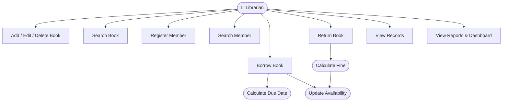
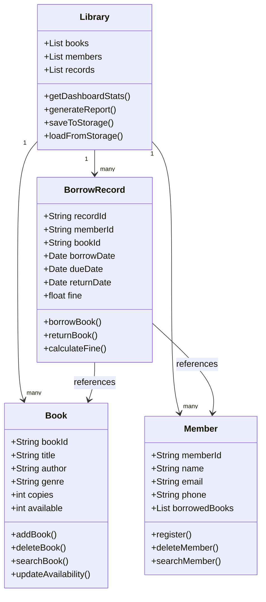
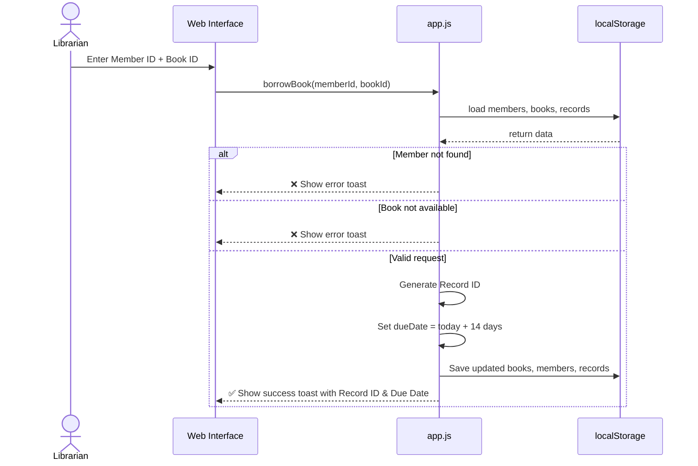
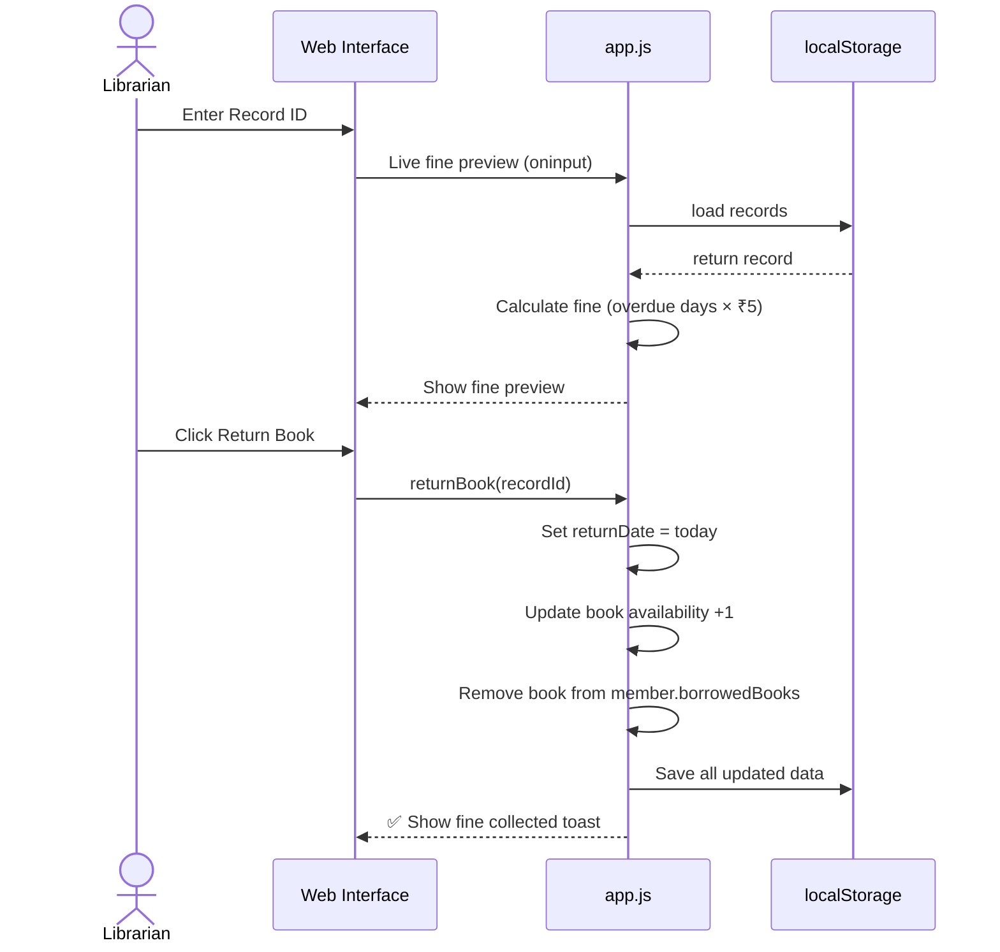
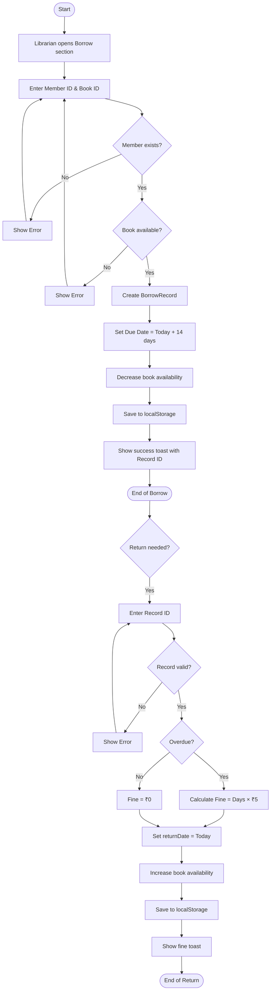

# Library Management System — Project Synopsis

**Student Name:** Sanket Pal  
**Project Title:** Library Management System  
**Technology Used:** HTML5, CSS3, JavaScript (Web Application)  
**Date:** May 2026  
**🌐 Live Website:** [https://sanketpal528-cyber.github.io/library_management.py/](https://sanketpal528-cyber.github.io/library_management.py/)  
**📁 GitHub Repository:** [https://github.com/sanketpal528-cyber/library_management.py](https://github.com/sanketpal528-cyber/library_management.py)

---

## 1. Introduction

A Library Management System (LMS) is a software application designed to automate and simplify the day-to-day operations of a library. Managing books, members, and borrowing records manually is time-consuming and error-prone. This project provides a simple, efficient, and user-friendly **web-based solution** to handle all core library operations digitally — accessible directly in any browser without any installation.

---

## 2. Problem Statement

Traditional libraries rely on manual registers and paper-based records to track books and members. This leads to:
- Difficulty in finding available books quickly
- No easy way to track overdue books or collect fines
- Risk of data loss due to physical damage to records
- Slow and inefficient member registration and book issuing process

This project addresses all of the above problems through a structured digital system.

---

## 3. Objectives

- Provide a clean, web-based interface for easy navigation
- Allow librarians to add, view, search, and edit books
- Register and manage library members
- Issue (borrow) and return books with due date tracking
- Automatically calculate fines for overdue returns (₹5 per day)
- Generate summary reports and a live dashboard
- Store all data persistently using browser `localStorage` so data is not lost on page refresh

---

## 4. Scope of the Project

This system covers the following functional areas:

| Module              | Features                                              |
|---------------------|-------------------------------------------------------|
| Dashboard           | Live stats — books, members, borrows, fines, overdue  |
| Book Management     | Add, Edit, View, Search, Delete books                 |
| Member Management   | Register, Edit, View, Search members                  |
| Borrow / Return     | Issue books, return books, live fine preview           |
| Records             | Full history with filters (Active/Returned/Overdue)   |
| Fine Calculation    | Auto-calculate overdue fines at ₹5/day                |
| Reports             | Summary stats, top borrowed books, overdue list       |
| Data Persistence    | Browser `localStorage` (no server or database needed) |

---

## 5. System Design

### 5.1 Use Case Diagram



---

### 5.2 Class Diagram



---

### 5.3 Sequence Diagram — Borrow a Book



---

### 5.4 Sequence Diagram — Return a Book



---

### 5.5 Activity Diagram — Borrow / Return Flow



---

### 5.6 Data Structures (localStorage Schema)

**Books** (key: `lms_books`):
```json
{
  "B001": {
    "title": "Python Programming",
    "author": "Guido van Rossum",
    "genre": "Technology",
    "copies": 3,
    "available": 2
  }
}
```

**Members** (key: `lms_members`):
```json
{
  "M001": {
    "name": "Sanket Pal",
    "email": "sanket@example.com",
    "phone": "9876543210",
    "borrowedBooks": ["B001"]
  }
}
```

**Records** (key: `lms_records`):
```json
{
  "R0001": {
    "memberId": "M001",
    "bookId": "B001",
    "borrowDate": "2026-05-01",
    "dueDate": "2026-05-15",
    "returnDate": null,
    "fine": 0
  }
}
```

---

## 6. Features

- **Persistent Storage**: All data is saved to JSON files. No data is lost when the program exits.
- **Availability Tracking**: The system tracks how many copies of each book are available in real time.
- **Due Date & Fine System**: When a book is borrowed, a 14-day due date is set. If returned late, a fine of ₹5 per overdue day is calculated automatically.
- **Search Functionality**: Books can be searched by title or author; members can be searched by name or ID.
- **Input Validation**: The system validates user inputs and shows appropriate error messages.
- **Clean Tabular Output**: All records are displayed in formatted tables for easy reading.

---

## 7. Technologies Used

| Technology   | Purpose                                      |
|--------------|----------------------------------------------|
| HTML5        | Page structure and layout                    |
| CSS3         | Styling, responsive design, animations       |
| JavaScript   | All logic — CRUD, borrow/return, fines       |
| localStorage | Persistent data storage in the browser       |

---

## 8. Limitations

- Data is stored in browser `localStorage` — clearing browser data will erase records.
- No backend or database — data is not shared across different devices or browsers.
- No login/authentication system is implemented in this version.
- Designed for single-user use (no multi-user or network support).

---

## 9. Future Enhancements

- Integrate a proper backend using **Flask** or **Node.js**
- Add a database (**SQLite** or **MySQL**) for persistent multi-device storage
- Add user authentication (Admin / Librarian login)
- Generate and download PDF reports for borrowing history
- Send email/SMS reminders for overdue books
- Add a mobile-friendly PWA (Progressive Web App) version

---

## 10. Conclusion

The Library Management System successfully automates the core operations of a library through a clean, modern web interface. It demonstrates practical use of HTML, CSS, and JavaScript including DOM manipulation, localStorage, date/time handling, and responsive design. The live website is accessible at **[https://sanketpal528-cyber.github.io/library_management.py/](https://sanketpal528-cyber.github.io/library_management.py/)** and serves as a strong foundation that can be extended with a backend and database in the future.

---

*Project developed as a Micro Project for academic purposes.*
